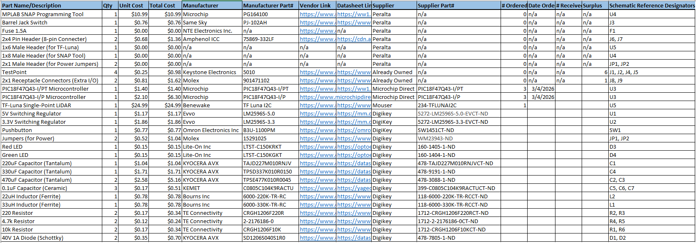

## Overview

The table below shows a list of all the components used in the making of the subsystem, the quantity of each, and their costs. It also includes each component's manufacturer/part#, links to supplier/datasheet, and the reference designator used to symbolize each component in the electrical schematic. This bill of materials helps to ensure selection and acquisition of all necessary components for the subsystem, as well as documents exactly how the subsystem was physically created.

## Resources

The bill of materials is available as a pdf [here](314-IndividualSubsystemBOM.pdf) and as an Excel worksheet [here](314-IndividualSubsystemBOM.xlsx).
