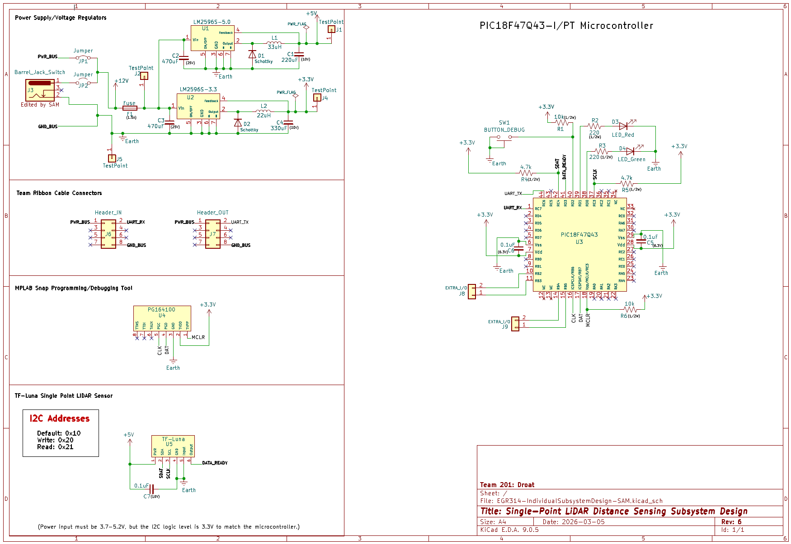

## Overview

This schematic below is designed to indicate the electrical connections/circuitry of the LiDAR subsystem. The "Power Supply/Voltage Regulators" section shows that power can be taken from the team bus connection or a wall supply via barrel jack, and it is sent through two different switching voltage regulators: one to provide 5V and one to provide 3.3V. This satisfies Requirement 1(Surface mounted, 3.3V swithcing power regulator). The "Team Ribbon Cable Connectors" section highlights the connections to team subsystems in and out for UART communication and shared power. This satisfies Requirement 5(Wired communication). The "MPLAB Snap Programming/Debugging Tool" section shows the tool which will be used to upload code to the microcontroller after soldering it to the PCB. The "TF-Luna Single Point LiDAR Sensor" section shows the chosen LiDAR sensor and its connections to the microcontroller, as well as the data addresses which will be used for I2C communication. This satisfies Requirement 3(Serial sensor), Requirement 4(Able to determine distance from device to object in its path), and Requirement 6(Sufficient refresh rate). Finally, the "PIC18F47Q43-I/PT Microcontroller" section displays the chosen microcontroller for the subsystem, which of its pins connect to power/peripherals, two external status LEDs, one pushbutton for debugging purposes, and multiple extra headers connected to unused pins in the event that additions must be made to the system. This satisfies Requirement 2(Surface mounted microcontroller). The subsystem as a whole will allow the user to effectively navigate the product's environment and collect data on its surroundings.

{style width:"350" height:"300;"}

## Resouces

The schematic as a PDF download is available [*here*](EGR314-IndividualSubsystemDesign-SAM.pdf), and the Zip folder of the project [*here*](EGR314-IndividualSubsystemDesign-SAM.zip).